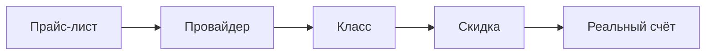
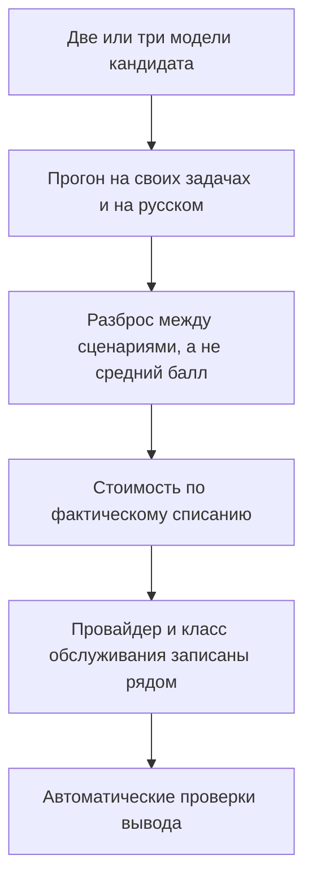

Как выбрать LLM для проекта — вопрос, с которым ко мне приходят уже с готовым ответом. Клиент увидел модель в статье, в видео или в чужом бенчмарке и говорит: хочу эту, она лучшая. Дальше выясняется, что бенчмарк был англоязычный, что тест гонялся в режиме размышлений — а это медленно и дорого, — и что к его задаче всё это отношения не имеет.

В начале августа мы прогнали восемь моделей через две реальные задачи на русском: генерацию обучающего контента и продающие диалоги с жёстким покупателем. Ниже — что из этого следует для выбора модели под проект.

## Дорогая модель не значит лучшая

Разрыв в цене между моделями давно перестал соответствовать разрыву в качестве. По данным [BenchLM](https://benchlm.ai/stats/llm-pricing) на август 2026, цена входного миллиона токенов у разных моделей отличается в тысячу раз — от трёх центов до тридцати долларов. Разброс оценок качества на индексе Artificial Analysis за то же время — от 49 до 57 баллов. Тысячекратная разница в деньгах покупает восемь пунктов.

В нашем прогоне это видно на одной паре. Gemini 3.5 Flash в тесте на продажи набрал 78 баллов, диалог обошёлся в $0.0474. GPT-5.6 Luna получил 87, диалог стоил $0.0010. Почти в пятьдесят раз дешевле и на девять баллов лучше — при том, что Gemini здесь и есть та самая «топовая модель известного вендора», с которой к нам приходят чаще всего.

| Модель | Продажи, балл | $/диалог | $/1M токенов |
|---|---|---|---|
| GPT-5.6 Luna | 87 | $0.0010 | $0.350 |
| MiMo V2.5 Pro | 87 | $0.0047 | $0.522 |
| DeepSeek V4 Flash | 86 | $0.0007 | $0.130 |
| Gemini 3.5 Flash | 78 | $0.0474 | $5.250 |

Возражение здесь есть, и оно серьёзное. Экономия на модели не бесплатна: более слабая модель чаще ошибается, требует повторов и более длинных цепочек вызовов, и скидка за токен съедается ретраями. [Аналитики рынка](https://inference.net/content/llm-api-pricing-comparison/) прямо пишут, что считать надо стоимость верного ответа, а не стоимость токена, и что экономия материализуется только там, где есть маршрутизация запросов и инфраструктура замеров. Без них накладные расходы на зоопарк моделей превысят экономию.

Мы с этим согласны — и именно поэтому меряем не цену, а цену вместе с качеством и стабильностью. Разница в том, что в нашей таблице дешёвая модель не проигрывает по качеству: DeepSeek V4 Flash отстаёт от лидера на один балл. Платить в пятьдесят раз больше за девять баллов минуса — не тот случай, когда премия за фронтир окупается ретраями.

## У одной модели не одна цена, а одиннадцать

Выбирая LLM для проекта, по деньгам сравнивать придётся не то, что кажется. «Цена модели» — понятие обманчивое: это не число, а список. Одну и ту же модель раздают несколько провайдеров, у каждого свой тариф, и разница между ними больше, чем разница между разными моделями.

[Документация OpenRouter](https://openrouter.ai/docs/guides/overview/models) описывает это прямо: общий список моделей отдаёт по одной цене на модель, а реальный расклад виден только в списке эндпоинтов конкретной модели. Для GPT-5.6 Luna на снимке 2 августа 2026 года он выглядел так.

| Кто отдаёт | Вход / 1M | Выход / 1M |
|---|---|---|
| OpenAI, экономкласс | $0.05 | $0.30 |
| OpenAI, стандарт | $0.10 | $0.60 |
| OpenAI, приоритет | $0.20 | $1.20 |
| Amazon Bedrock | $0.22 | $1.32 |
| Azure | $1.00 | $6.00 |
| Azure, европейский регион | $1.10 | $6.60 |

Одна модель, один и тот же вес, одинаковые ответы. Между стандартным тарифом у самого вендора и стандартным у перепродавца — одиннадцать раз. Если добавить в сравнение экономкласс, разрыв вырастает до двадцати двух.

У моделей с открытыми весами список ещё длиннее, потому что хостить их может кто угодно: у GLM-5.2 мы насчитали тридцать три эндпоинта с разбросом в 8,3 раза. Тарифы держатся недолго, поэтому дату снимка стоит записывать рядом с цифрой — через месяц числа будут другими.

Часть этого разброса — даже не разные провайдеры, а разные режимы у одного. Экономкласс вдвое дешевле стандартного, приоритетный вдвое дороже, и отличаются они не качеством ответа, а местом в очереди. Это отдельная большая тема, и на ней можно всерьёз экономить — мы к ней ещё вернёмся отдельно.

Скидка — история совсем другая, хотя множитель бывает тот же. У Luna в тот момент действовала промо-акция OpenAI: минус 50% на все режимы. Она временная, её могут снять в любой момент. Совпадающее «вдвое дешевле» не делает акцию и режим работы одним и тем же.

И это, пожалуй, главное, что стоит унести из раздела про деньги. Модель, которая полтора месяца назад была для нас дорогим вариантом «на самые острые задачи», стала вдвое дешевле — без единой строчки изменений внутри неё. Расстановку сил на рынке иногда меняет решение вендора про скидку, а не новый релиз.

### Прайс-лист и счёт — разные числа

Даже правильно выбранный тариф не гарантирует, что спишут именно столько. У GLM-5.2 фактическое списание разошлось с прайсом на 108%: маршрутизатор увёл запрос к другому провайдеру. Любая цифра, полученная умножением токенов на прайс, — оценка, а не факт.

Поэтому мы запрашиваем у API реально списанные кредиты и в каждой строке лидерборда помечаем, что это: фактическое списание или расчётная оценка. Проверка на живом вызове: списано $0.000195 против $0.000197 расчётных — сходится.

## Место в англоязычном рейтинге ничего не говорит о работе на русском

Это самое дорогое заблуждение из всех, и оно же самое распространённое. Модель заняла высокое место в известном бенчмарке — значит, справится и с вашей задачей. Проблема в том, что почти все известные бенчмарки англоязычные, а разрыв между языками у одной и той же модели больше, чем разрыв между моделями.

Есть исследование, которое меряет это чисто. [MMLU-ProX](https://arxiv.org/abs/2503.10497) — набор из 29 языков, где каждая языковая версия содержит одни и те же 11 829 заданий. Прогнали 36 моделей. Разрыв между языками дошёл до 24,3 процентного пункта. Русский в наборе есть.

Причина не в том, что русских текстов мало в обучении. [Разбор на бенчмарке многоходовых диалогов](https://lilt.com/blog/multilingual-llm-performance-gap-analysis) в марте 2026 года показал, что от 72 до 87 процентов ошибок на неанглийских языках — это ограничения самой модели: неэффективная токенизация и внутреннее «мышление на английском» с постоянным переводом туда-обратно. На нехватку данных приходится сильно меньше. Отдельно там видно, что на длинных диалогах — от шести ходов — качество на неанглийском проседает, а на английском держится ровно. Оговорюсь: исследование опубликовала компания, которая продаёт услуги локализации, то есть сторона заинтересованная. Но метод там прозрачный, а вывод сходится с MMLU-ProX, где заинтересованных нет.

К этому добавляется чистая арифметика. [Кириллица дробится на токены хуже латиницы](https://habr.com/ru/articles/1032610/): один и тот же смысл на русском стоит в полтора-три раза больше токенов, чем на английском. Значит, при одинаковом тарифе русский текст дороже, ответ идёт дольше, а в контекстное окно помещается меньше.

Напрашивается очевидный обходной путь — писать промты на английском. Работает он не всегда: в [исследовании культурного контекста CulturALL](https://arxiv.org/abs/2604.19262) английские промты дали точность на 8% **ниже**, чем промты на родном языке, потому что перевод вымывает контекст задачи. Для сухой аналитики английский промт, скорее всего, выиграет. Для диалога с клиентом — не факт.

### Как это выглядит в реальном ответе

Теория теорией, но в наших прогонах языковая проблема вылезла в форме, которую не ловит ни одна метрика качества.

MiMo V2.5 вёл диалог с тёплым клиентом, обсуждал схему оплаты и написал:

> «Поэтапная оплата: 三分之一 сейчас, 三分之二 после запуска — вам спокойнее, нам тоже.»

Это «одна треть» и «две трети» китайскими иероглифами. В коммерческом предложении российскому клиенту. Не разовый сбой: у той же модели иероглифы вылезли в трёх темах из пяти, у старшей версии — семь вставок в одном уроке по финансам, включая «13-недельный滚动прогноз» и «量化指标» вместо «количественные показатели».

Отдельная история у Gemma — там текст физически рассыпался прямо в реплике клиенту:

> «Вы продолжаете тратить времяH ресурсы… это тихий убыток, который вы несёте каждыйCLL»

Четыре повреждения в одном сообщении. И вот что здесь важно: по смыслу этот ответ хороший. Потребность выявлена, возражение отработано, к следующему шагу подведено. Ни один пункт стандартной оценки — выявление потребности, работа с возражениями, честность, закрытие — такое не поймает. А отправить это клиенту нельзя.

Ещё интереснее, что режим размышлений на загрязнение влияет непредсказуемо, причём внутри одного семейства моделей в противоположные стороны. У старшей версии MiMo без размышлений было семь иероглифов, с размышлениями — ноль. У младшей без размышлений четыре, с размышлениями — девятнадцать. Один вендор, одна дата, один флаг, противоположный результат.

### Вывод отсюда практический, а не языковой

Иероглиф или склейка кириллицы с латиницей — это то, что ловится обычным поиском по тексту. Не моделью-проверяльщиком, не вторым запросом к нейросети, а простым автоматическим правилом на выходе.

Мы такую проверку теперь ставим в оба теста, но гораздо важнее ставить её в проектах заказчика. Проскочить может практически у любой модели — и это, пожалуй, лучший аргумент в пользу того, что нельзя просто взять и воткнуть модель в проект. Вокруг неё нужна обвязка: проверки вывода, ограничения, обработка отказов. О том, из чего эта обвязка состоит, я подробно писал в [разборе архитектуры AI-агента](/blog/ai-agent-architecture).

## Режим размышлений: восемь минут работы и ноль слов на выходе

С «умным режимом» связано отдельное заблуждение — что его надо включать везде, где важно качество. Мы дали моделям бюджет в 32 тысячи токенов на размышления, вдвое больше обычного, специально чтобы хватило и на мысли, и на текст. Вот что получилось на теме «Ценообразование в B2B».

| | HY3 | MiMo V2.5 |
|---|---|---|
| Потрачено токенов на размышления | 32 925 | 30 844 |
| Время работы | 507 секунд | 420 секунд |
| Написано слов | **0** | **0** |

Модель не упала. Не вернула ошибку. Не превысила лимит запросов. Она честно отработала восемь с половиной минут, списала деньги и вернула пустую строку — всё место заняли размышления, которых пользователь не видит.

Самое неприятное здесь — что бюджет не лечится увеличением бюджета. В прошлом прогоне такое случилось один раз, и вывод напрашивался очевидный: мало места, дайте больше. Дали. Вдвое. Модель стала думать вдвое дороже и молчать ровно так же. Это уже четвёртый такой случай у моделей трёх разных вендоров — то есть не баг конкретной модели, а класс поведения.

Отсюда и главная сложность с планированием: заранее неизвестно, сколько токенов уйдёт на конкретной задаче. Дашь мало — получишь пустой ответ. Дашь много — заплатишь за размышления, которые всё равно могут не сойтись.

### Признак, по которому это можно предсказать

Один показатель оказался неплохим предиктором — доля размышлений в оплаченном выводе.

| Модель | Доля размышлений | Пустых ответов |
|---|---|---|
| HY3 | 73% | 1 из 5 |
| MiMo V2.5 | 55% | 1 из 5 |
| Gemma 4 31B | 19% | 0 |
| MiMo V2.5 Pro | 4% | 0 |

Модель, которая на команду «думай усердно» тратит на мысли больше половины вывода, — кандидат на пустой ответ. Модель, которая тратит 4%, команду фактически игнорирует.

### Где размышления действительно нужны

Не хочу, чтобы это читалось как «режим размышлений вреден». У HY3 он реально работал: средний балл на завершённых темах вырос с 76 до 85, объём удвоился, появилась структура, которой без него не было. Академические замеры говорят то же самое — [на трудных задачах размышления окупаются, на лёгких это чистая переплата](https://openreview.net/forum?id=PVooP3d7cI).

И всё-таки в итоговый рейтинг у нас ушла конфигурация без размышлений. «В среднем на девять баллов лучше, но с вероятностью 20% выдаёт пустоту» — это не то, что ставят в прод.

Практическое правило простое. Размышления стоит включать там, где вы готовы платить больше и ждать дольше: фоновая обработка, ночные пересчёты, задачи без требований к скорости. Там пустой ответ ловится повтором, и никто этого не заметит. Во всём, что работает в реальном времени и смотрит в лицо клиенту, цена ошибки другая — а выигрыш в качестве, как показывает наш же замер, далеко не всегда окупает разницу в деньгах и времени.

Стоит учесть и то, что выбор есть не везде: у Gemini 3.5 Flash размышления теперь принудительные, попытка их отключить возвращает ошибку. Раньше флаг работал.

## Предсказуемость бюджета важнее цены за токен

Если из всей статьи забрать одну мысль про то, как выбрать LLM для проекта, пусть это будет она. Средний балл и цена за миллион токенов — это то, что видно в таблице. А в проекте болит другое: одна и та же модель на похожих задачах тратит разное количество токенов, и бюджет перестаёт быть предсказуемым.

У нас для этого есть отдельный показатель — стабильность. Он меряет не уровень, а разброс между сценариями, и разница бывает драматичной. HY3 в продажах: 84, 87, 85, 84 — разброс три балла, ни одного провала. Gemma: 84, 78, 71, 67 — разброс семнадцать. Отлично с финансовым директором, катастрофа с тёплым клиентом.

Для продакшена ровный на 85 лучше, чем иногда 84, а иногда 67. Средний балл прячет ровно ту информацию, ради которой тест и затевался. Подробнее этот сюжет — на типах клиентов и с транскриптами — я разбирал в статье про [ИИ-бота для продаж](/blog/ai-bot-dlya-prodazh).

### Цена вызова и цена модели — разные вопросы

Многословность модели влияет на счёт сильнее, чем тариф. Лучше всего это видно на паре, где тарифы почти совпадают.

| | $/1M токенов | Урок | Диалог |
|---|---|---|---|
| GPT-5.6 Luna | $0.350 | $0.0039 | **$0.0010** |
| HY3 | $0.330 | **$0.0016** | $0.0023 |

Тариф отличается на шесть процентов. При этом в уроках HY3 дешевле в два с половиной раза, а в диалогах дороже в два с лишним. Luna пишет длинные уроки и короткие реплики, HY3 — наоборот, и вся разница в счёте делается этим.

Это не наша особенность. Независимый замер на 25 моделях показал, что рейтинг по качеству и рейтинг по расходу токенов совпадают слабо, а «накладные расходы на многословность» различаются между моделями примерно в девять раз.

Отсюда правило: тариф отвечает на вопрос, сколько стоит модель. Цена вызова — сколько стоит ваша задача на этой модели. Нужны оба ответа, и путать их дорого.

### Куда утекают деньги, если не считать

К нам не раз приходили с просьбой оптимизировать проект, доставшийся от других исполнителей. Картина повторяется: расходы растут, клиент не понимает почему, а метрик нет вообще — ни расхода токенов по типам задач, ни доли повторов, ни стоимости одного полезного действия. Оптимизировать в такой ситуации нечего, сначала надо начать измерять.

Это, если честно, тот же самый сюжет, что и с [пилотами ИИ, которые прошли, а эффекта не дали](/blog/pochemu-ne-rabotaet-vnedrenie-ii): пока не зафиксированы показатели до старта, обсуждать результат не с чем.

## Что мы поменяли в самом замере

Раз уж речь о том, каким цифрам верить, стоит сказать и про свои. За последние прогоны в методику добавилось четыре вещи, и каждая из них имеет смысл и за пределами нашего бенчмарка.

**Версия теста рядом с баллом.** Рубрика оценки меняется: ужесточается судья, добавляются проверки. Балл, полученный старой версией, несравним с новым — поэтому на [странице бенчмарков](/benchmarks) теперь есть колонка с версией теста и переключатель «только актуальные». Если в чужом рейтинге рядом с цифрой не написано, когда и чем её мерили, цифра мало что значит.

**Контрольная модель в каждом прогоне.** Берём модель, уже замеренную текущей версией теста, и гоняем её снова. Держится балл — линейка стабильна. Без этого невозможно отличить «новая модель слабее» от «судья стал строже». У нас контроль дал 93, 94, 93 за десять дней: разброс в один балл, то есть шум.

**Проверка гигиены вывода.** Тот самый поиск иероглифов и склеек. Раньше он стоял только в тесте на обучающий контент — теперь в обоих.

**Оплата по факту.** Стоимость берётся из реально списанных кредитов, а не из умножения токенов на прайс. Где фактического замера нет, строка честно помечена как оценка.

Про то, как устроена автоматическая оценка качества и почему судью тоже надо проверять, есть отдельный [разбор про LLM-судью](/blog/llm-judge-validation). А про то, что происходит с ценой уже после выбора модели — провайдер, класс обслуживания, кэш и порог длинного контекста, — я собрал отдельно: [как снизить расходы на LLM](/blog/kak-snizit-rashody-na-llm).

## Выдумывают все, но по-разному

Ещё одна вещь, которая не видна в рейтингах, но решает при выборе модели под контент. Сочинённая статистика, приписанная реальным брендам, нашлась у каждой модели новой когорты — без исключений.

- «Salesforce: proposal-to-close +22%», «HubSpot сократила цикл на 17%»
- «Nike: AI-прогноз с точностью 95%, онлайн-продажи +82%»
- «Яндекс: текучесть ниже рынка на 15%»
- у Gemma авторами известной книги про продажи названы два несуществующих человека

А у GPT-5.6 Luna в уроках объёмом 3 200–3 400 слов — ни одной цифры, приписанной бренду. Вот в этом и состоит разрыв в семь баллов между ней и остальными: не в объёме и не в красоте слога.

Границу мы проводим так: безымянная отраслевая статистика вроде «по данным исследований, 82% компаний» — жанровая условность делового текста, за неё не штрафуем. Конкретная цифра под конкретной компанией — фабрикация.

## Что брать под какую задачу

Здесь сводка по обеим задачам — с неё удобно начинать выбор модели под проект. Все цифры — текущая версия теста, тариф самого дешёвого провайдера в стандартном классе, снимок 2 августа 2026 года. Живая таблица со всеми моделями и фильтрами — на странице бенчмарков.

| Модель | Обучающий контент | Продажи | $/1M | Стоимость урока |
|---|---|---|---|---|
| GPT-5.6 Luna | **93** | **87** | $0.350 | $0.0039 |
| Gemini 3.6 Flash | 92 | 79 | $4.50 | $0.0623 |
| Gemini 3.5 Flash | 91 | 78 | $5.25 | $0.0779 |
| DeepSeek V4 Flash | 87 | 86 | $0.130 | **$0.0010** |
| Gemma 4 31B | 86 | 75 | $0.215 | $0.0014 |
| MiMo V2.5 Pro | 85 | **87** | $0.522 | $0.0042 |
| HY3 | 76 | 85 | $0.330 | $0.0016 |
| MiMo V2.5 | 74 | 69 | $0.168 | $0.0013 |

Как мы распорядились этим у себя. **GPT-5.6 Luna** после того, как она подешевела вдвое, стала основным вариантом там, где качество критично: самые острые задачи, тексты, которые пойдут клиенту. **DeepSeek V4 Flash** отстаёт от неё не сильно, а стоит вчетверо меньше — поэтому во многих местах мы продолжаем работать на нём и менять его на что-то другое смысла не видим.

Ещё три наблюдения из этой таблицы, которые стоят внимания.

Смена поколения у вендора почти ничего не даёт: Gemini 3.6 против 3.5 — плюс один балл в обучении и плюс один в продажах. Обе цифры внутри шума. Номер версии в названии модели — маркетинг, а не результат. Свежий пример того же — [релиз Qwen 3.8 Max](/blog/qwen-3-8-max-v-proekte): 2,4 триллиона параметров в заголовке, обещание второго места в мире и пятое место в текстовом рейтинге, когда наконец появились цифры.

Умение объяснять и умение продавать не связаны, и это третий наш прогон подряд с таким выводом. Gemma пятая в обучении и седьмая в продажах, HY3 седьмой в обучении и четвёртый в продажах. Выбирать модель «вообще лучшую» бессмысленно — только под конкретную задачу.

И самое практичное: смена задачи двигает балл на два десятка пунктов, а смена поколения модели — на один. Поэтому тестировать надо не модель, а модель на вашей задаче и на вашем языке.

## Как выбрать LLM для проекта: короткий ответ

Место в чужом рейтинге — плохая опора. Оно получено на другом языке, другой задаче, часто в режиме размышлений и почти наверняка по другому тарифу, чем достанется вам.

Порядок, который работает у нас: взять две-три модели-кандидата, прогнать их на своих реальных задачах и на русском, посмотреть не средний балл, а разброс между сценариями, и посчитать деньги по фактическому списанию с указанием провайдера и класса обслуживания. И обязательно поставить на выходе автоматические проверки, которые не зависят от модели, — иероглиф в коммерческом предложении не поймает ни одна метрика качества.

Между тем прогоном, о котором я писал полтора месяца назад, и этим сменились три модели в верхушке, одна подешевела вдвое из-за скидки вендора, а у другой перестал отключаться режим размышлений. Это всё изменения за полтора месяца — поэтому замер стоит повторять, а не делать один раз и ссылаться на него год.

Наша таблица открыта и обновляется из базы — можно посмотреть [текущие результаты со всеми фильтрами](/benchmarks) и сравнить со своими наблюдениями.

А сами прогоны, включая те, что не дошли до статей — сломанные замеры, странные ответы моделей и находки, которые пока непонятно как трактовать, — выкладываю в канале [@maslennikovigor](https://t.me/maslennikovigor).
