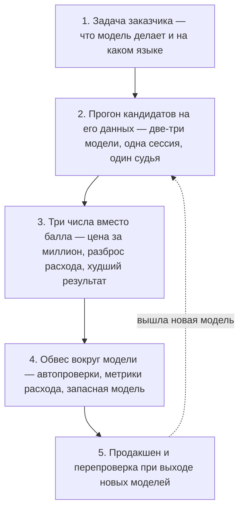

Qwen 3.8 Max вышел 3 августа 2026 года, и в тот же день ко мне пришли два вопроса: правда ли он обошёл всех и надо ли срочно менять модель в проекте. Отвечаю по порядку, с цифрами и оговорками, потому что цифры тут интереснее заголовков.

## Что вышло 3 августа

Alibaba выпустила Qwen 3.8 Max — флагманскую модель линейки Qwen. Заявлено 2,4 триллиона параметров, контекст в миллион токенов и работа с картинками, видео и документами наравне с текстом. Модель уже доступна по API в Alibaba Cloud Model Studio, веса обещают выложить в течение недели — всё это [из официального пресс-релиза Alibaba Cloud](https://www.alibabacloud.com/press-room/alibaba-unveils-qwen3-8-max) от 3 августа.

До этого модель две недели жила как превью. Её показали 19 июля на конференции в Шанхае с формулировкой «уступает только Fable 5» — без единой опубликованной цифры, без карточки модели и без описания методики. Третьего августа цифры наконец появились: пятое место в общем текстовом рейтинге Arena, второе в рейтинге по изображениям, четвёртое во фронтенд-коде.

Для заказчика здесь важна не столько сама модель, сколько дистанция между двумя датами. Две недели заявление «мы вторые в мире» жило без единого проверяемого числа — и сдулось до пятого места, как только числа появились.

## Почему 2,4 триллиона параметров — не та цифра

Смотреть надо на активные параметры. У новой модели их 95 миллиардов из 2,4 триллиона: на каждый токен она включает около четырёх процентов себя, остальное молчит. Архитектура называется разреженной смесью экспертов — модель разбита на специализированные блоки, и на каждый запрос работает лишь часть из них.

Для проекта это меняет две вещи: сколько вы платите и [как долго ждёте ответ](/blog/pochemu-ii-bot-dolgo-otvechaet). По деньгам и скорости вы получаете модель уровня 95 миллиардов параметров, а не 2,4 триллиона. Обратное тоже верно — число из заголовка пресс-релиза само по себе не обещает качества.

Поэтому в разговоре с подрядчиком «два с половиной триллиона параметров» аргументом не является. Аргументы — активные параметры, цена за миллион токенов и результат на вашей задаче.

## Кто в топе, если смотреть не общий рейтинг, а свою отрасль

В медицинской категории текстового рейтинга Arena первое место сейчас у Qwen 3.8 Max. [Arena](https://arena.ai) — это площадка, где люди вслепую сравнивают ответы двух моделей и голосуют за лучший; в медицинской категории на 1 августа 2026 года набрано больше 435 тысяч голосов по 354 моделям.

| # | Модель | Оценка | Голосов | Цена вход / выход за 1M |
|---|---|---|---|---|
| 1 | qwen3.8-max | 1527 ±38 | 229 | $2 / $6 |
| 2 | claude-opus-4-7-thinking | 1521 ±10 | 4 046 | $5 / $25 |
| 3 | claude-opus-4-6-thinking | 1520 ±9 | 4 960 | $5 / $25 |
| 4 | kimi-k3-max | 1519 ±37 | 246 | $3 / $15 |
| 5 | claude-opus-4-6 | 1514 ±9 | 5 155 | $5 / $25 |
| 6 | claude-opus-4-7 | 1514 ±10 | 4 102 | $5 / $25 |
| 7 | claude-fable-5 | 1510 ±18 | 1 237 | $10 / $50 |

В первой четвёрке — две китайские модели, и обе дешевле любой американской из этого списка. Самая дорогая модель таблицы стоит в пять раз больше первой на входе и в восемь раз больше на выходе, а стоит при этом седьмой.

Теперь оговорка, без которой таблицу читать нельзя. Разрыв между первым и седьмым местом — 17 пунктов, а разброс оценки у Qwen составляет ±38 и у Fable ±18. Интервалы перекрываются, и это значит, что «Qwen обошёл Fable» статистика не подтверждает: у новой модели всего 229 голосов против четырёх-пяти тысяч у моделей Anthropic, отсюда и широкий разброс. Подтверждает она другое, и для заказчика это важнее любого первого места: разницы в качестве, которую видно сквозь шум, между этими моделями нет. А разница в цене — пятикратная.

## Кейс: клиент хотел самую дорогую модель для медицинских заключений

Ко мне приходил клиент из здравоохранения с уже принятым решением: ставим Claude Fable 5. Модель должна была давать второе мнение по медицинским случаям, и он был уверен, что тут нужна лучшая модель на рынке. Лучшей он считал ту, про которую больше всего написано и сказано.

Мы посчитали для него два числа: во что обойдётся его объём запросов на Fable 5 и что он за эти деньги получает в качестве. По деньгам разрыв с соседями по таблице был пяти-восьмикратным. По качеству в его собственной предметной области выигрыша не обнаружилось вообще — в медицинской категории Fable 5 идёт седьмым. Клиент передумал в том же разговоре.

Ошибка здесь не в выборе дорогой модели. Дорогая модель бывает оправдана: для написания кода мы всегда берём топовые модели, потому что там разница видна сразу и окупается. Ошибка в том, что решение принималось по количеству прочитанного, а не по замеру на своей задаче.

## Сколько стоит Qwen 3.8 Max

Вход стоит $2 за миллион токенов, выход — $6 ([прайс QwenCloud](https://www.qwencloud.com/models/qwen3.8-max)). Предшественник по [прайсу Alibaba Cloud](https://www.alibabacloud.com/help/en/model-studio/model-pricing) стоил $2,5 и $7,5, то есть новый флагман подешевел примерно на пятую часть. Для флагманского уровня это недорого: у Fable 5 те же цифры составляют $10 и $50.

Но бюджет проекта считается не по цене флагмана. В нашем батл-тесте первое место по соотношению цена/качество держит DeepSeek V4 Flash — $0,13 за миллион токенов при 87 баллах качества. Новый флагман по той же метрике стоит $4 за миллион, то есть в тридцать раз дороже. Для потоковой работы — генерации документов, обработки заявок, массовых ответов — это разные весовые категории, и новый флагман туда не поедет.

Ещё одна деталь из того же прогона. Модель Qwen, которая почти год держала у нас первое место по цене и качеству, в последнем замере съехала на восьмое место. Рейтинги живут своей жизнью, и выбор модели, сделанный год назад, стоит перепроверять — иначе проект продолжает платить за решение, которое давно перестало быть лучшим.

## Открытые веса: что обещано и что это даст

Веса Alibaba обещает выложить в течение недели после релиза, лицензию при этом не назвала. Девятнадцатого июля формулировка была «скоро», третьего августа стала «на следующей неделе». Два предыдущих флагмана этой же линейки так и остались закрытыми, поэтому до появления файлов это остаётся обещанием.

[Открытые веса](/blog/open-source-llm-deshevle) — это не «поставим модель на свой сервер». Модель на 2,4 триллиона параметров требует дата-центра, а не серверной в офисе. Практический смысл в другом: когда веса открыты, модель начинают хостить сторонние провайдеры, цена за токен падает, а компания перестаёт зависеть от одного поставщика и его тарифов.

Отдельный случай — отрасли, где данные нельзя отправлять во внешний API. Там открытые веса вообще единственный путь: модель разворачивается в контуре заказчика или у выбранного им провайдера. Для медицины, финансов и госсектора этот пункт часто важнее любого места в рейтинге.

## Как мы решаем, ставить ли новую модель в проект

Через прогон на задаче заказчика, а не по месту в рейтинге. Публичные бенчмарки отвечают на вопрос «какая модель лучше вообще», а проекту нужен ответ на вопрос «какая модель лучше вот здесь». Это разные вопросы, и ответы у них расходятся регулярно: в нашем прогоне восьми моделей [самая дорогая оказалась хуже самой дешёвой](/blog/kak-vybrat-llm-dlya-proekta) — 78 баллов против 87 при цене почти в пятьдесят раз выше.

Что мы проверяем на своих прогонах:

- Русский язык. Большинство публичных тестов англоязычные. Модель, отличная в английском, на русском начинает путать падежи, а иногда вставлять иероглифы в середину текста — такое бывало у нескольких моделей подряд. Ловится это автоматическими проверками в коде, не самой моделью.
- Предсказуемость счёта. Одна и та же модель на похожих задачах тратит разное количество токенов. Для большого проекта это означает бюджет, который невозможно спланировать, поэтому мы отдельно измеряем разброс расхода.
- Режим размышлений. Он даёт прибавку в качестве, но заметно дороже и медленнее, а на некоторых задачах прибавка не окупается вовсе. Мы включаем его выборочно, а не по умолчанию.
- Поведение в худшем случае. Средний балл скрывает провалы. Нас интересует худшая тема из прогона, потому что именно она однажды уедет клиенту.

Само качество ответов мы тоже меряем не на глаз: оценку ставит отдельная модель-судья по фиксированным критериям, и её согласие с живыми экспертами мы проверяли отдельно — [как это устроено, описано здесь](/blog/llm-judge-validation).

Порядок шагов от задачи до продакшена выглядит так:

Место в публичном рейтинге в этой цепочке не участвует ни на одном шаге.

Отсюда же следует, почему модель нельзя просто «воткнуть» в проект. Вокруг неё нужен обвес: автоматические проверки результата, метрики расхода, запасная модель на случай отказа основной. В [работе нашей команды](/ai-advantage) выбор модели — это часть разработки, а не отдельная услуга: модель меняется по ходу проекта, когда выходит что-то лучше. Клиенты, приходившие к нам на оптимизацию от других подрядчиков, чаще всего приходили именно с обратным — работающая интеграция есть, а метрик нет, и куда утекают деньги, никто не знает. Это же и есть [главная причина, по которой внедрение ИИ буксует после пилота](/blog/pochemu-ne-rabotaet-vnedrenie-ii).

## Что делать заказчику прямо сейчас

Если проект уже работает, ничего не менять. Выход нового флагмана — не повод для миграции: пока нет весов, независимых замеров и вашего собственного прогона, замена модели это риск без измеренной выгоды.

Если стоит выбор для новой задачи, порядок такой. Сначала определить, задача дорогая или потоковая: для потока флагман избыточен, там решают деньги за миллион токенов. Для точечных дорогих запросов имеет смысл взять двух-трёх кандидатов и прогнать их на своих данных, обязательно на русском.

И проверить, что в проекте вообще считаются метрики: расход токенов, стоимость запроса, доля неудачных ответов. Без них разговор про выбор модели беспредметен — сравнивать будет не с чем.

## Стоит ли брать Qwen 3.8 Max в проект: короткий ответ

Сегодня — нет, и не потому, что модель плохая. Веса не выложены, независимых замеров нет, первое место в медицинской категории стоит на 229 голосах и внутри статистического шума. Через две недели картина может стать совсем другой, и тогда это будет решение на данных, а не на пресс-релизе.

Сам я прогоню его через свой батл-тест, когда появятся веса и стабильная цена. Результаты прогонов — с ценами, баллами и провалами моделей — выкладываю в канале [@maslennikovigor](https://t.me/maslennikovigor) раньше, чем они попадают в статьи. Там же видно, как меняется расстановка: модель, державшая у меня первое место по цене и качеству почти год, уступила его на днях.
